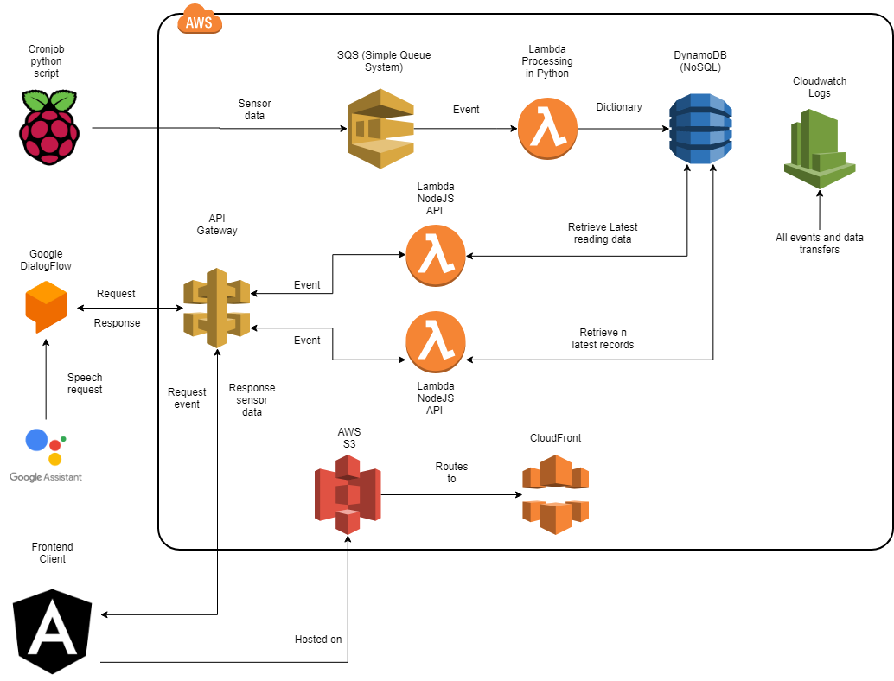

# Cloud Connected Fish tank
## Fishtank IOT hackathon project

- [arduino_module.py](arduino_module.py) is used for querying the arduino module for data from the PH Sensor
- [temp_module.py](temp_module.py) is used for querying the temperature sensors from the One Wire interface
- [fishtank.py](fishtank.py) is used as a wrapper library for calling the functions from arduino_module and temp_module
- [processingLambda.py](lambdas/processingLambda.py) is the python script run on the serverless lambda functions to process sqs data to dynamodb
- [query_cloud.py](query_cloud.py) is an initial proof of concept to manually invoke a function to read the latest data from the SQS queues
- [lambdas/sensors_to_cloud.py](sensors_to_cloud.py) is the python script to query all the sensors, build a dictionary object to send to the SQS queues. This is run on a cron job on the Raspberry PI.
- [lambdas/allEndpoint.js](lambdas/allEndpoint.js) NodeJS lambda to retrieve the last `n` records from the DynamoDB
- [lambdas/latestEndpoint.js](lambdas/latestEndpoint.js) NodeJS lambda to retrieve the latest reading data from DynamoDB
- [lambdas/notImplemented.js](lambdas/notImplemented.js) NodeJS lambda to return a 404 for not implemented endpoints
- [lambdas/googleHomeEndpoint.js](lambdas/googleHomeEndpoint.js) NodeJS lambda to interact with the google assistant and dialog flow systems.

# Steps to configure and run this project
## Arduino setup
- Clone the following [DFRobot_PH Arduino code](https://github.com/DFRobot/DFRobot_PH)
- Open in Arduino-IDE and add the libraries as mentioned in the above readme
- Remove the code checking for temperature data as this is managed by the Raspberry Pi and our temperature sensors is not supported by this device.
- Once the Arduino embedded code is running and the sensor calibrated, plug the Arduino into the Raspberry Pi's usb port.
## PI Setup
- Clone the git repository
- Add a cronjob with the following configuration: `1 * * * * python ~/fishtankiot/sensors_to_cloud.py`
- Setup an IAM role for your Raspberry Pi
- Install aws-cli
- Run aws configure to setup credentials for accessing all the AWS based systems and add the access and secret keys from the IAM role you setup on the PI
- Enable the One wire interface on the Raspberry Pi (for the temp readings) - make use of raspi-config
- Enable reading from the serial busses (for the Arduino readings) - make use of raspi-config
- Update the Arduino usb path in [fishtank.py](fishtank.py)
- Update the temperature sensor device ids in [fishtank.py](fishtank.py)

## AWS Setup 
- Create Lambdas for each of the scripts in [lambdas](lambdas)
- Link these lambdas up with an API gateway endpoint. 
- Add the 404 error lamba for invalid endpoints (or the default 404 from APIGateway can also be configured to catch all other calls)
- Setup DynamoDB database
- Setup SQS (non-fifo queue)
- Make sure the env variable 'DBNAME' is set to your Dynamodb instance name. This is used by all the NodeJS lambdas and the processing lambda
- Make sure the env variable 'LIMIT' is set on the allEndpoint lambda to specify the `n` values to retrieve
- Setup SQS event to trigger the [lambdas/sensors_to_cloud.py](lambdas/sensors_to_cloud.py) lambda

## Hosting 
- Setup a new S3 bucket
- `cd frontend`
- Update [/frontend/deployment.sh](/frontend/deployment.sh) with your s3 bucket name replace `fishtankiot` with your bucket name
- run ./deployment.sh [/frontend/deployment.sh](/frontend/deployment.sh)
- Setup a Cloudfront redirect to serve index.html as the error and intro pages, to allow angular to do the application routing

## DialogFlow and Google assistant integration
- Setup a Dialogflow ([https://dialogflow.com/](https://dialogflow.com/) intent to listen to the [lambdas/googleHomeEndpoint.js](lambdas/googleHomeEndpoint.js) hosted APIGateway endpoint.
- Add a @any keyword to listen for, the lambda will understand anything thrown at it and respond accordingly.
- Setup Google Assistant to make use of this intent.

## Youtube link to sensor live demonstration:
[https://youtu.be/qXQ8UBO6ISE](https://youtu.be/qXQ8UBO6ISE)

## Link to CloudFront hosted S3 bucket
[http://dgxpvcf8ay4dh.cloudfront.net/sensor](http://dgxpvcf8ay4dh.cloudfront.net/sensor) 

## High-level deployment diagram:

## Physical diagram:

## Physical wiring and sensor images

## Google Assistant example

